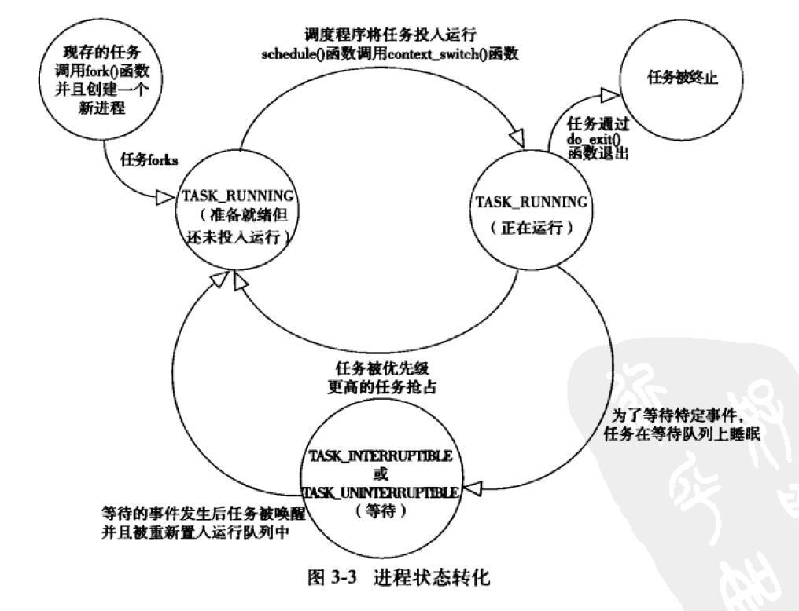
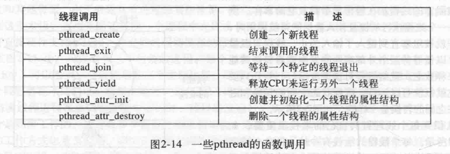
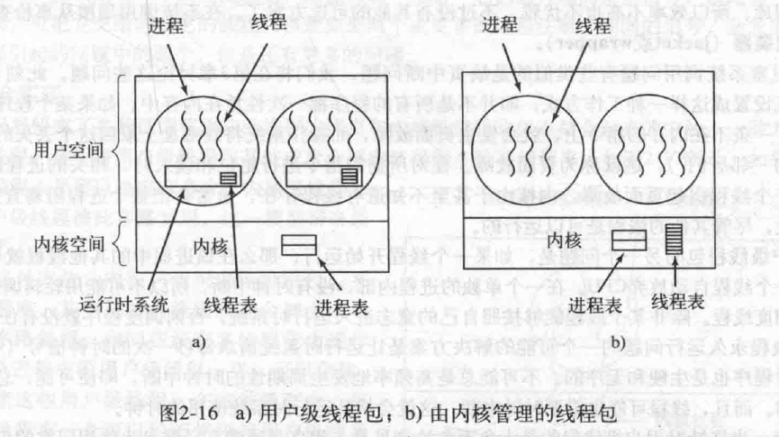
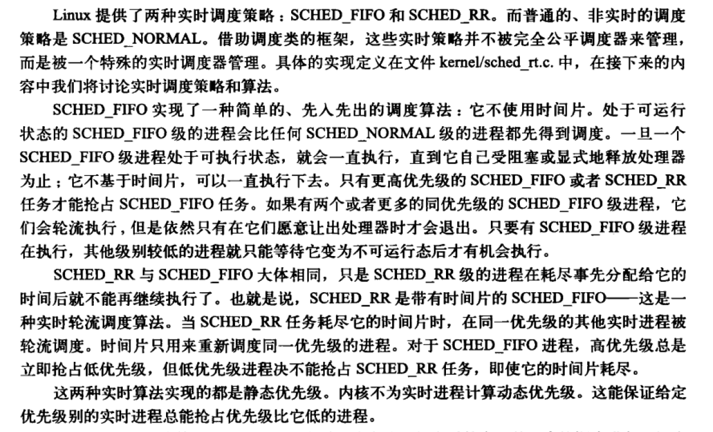
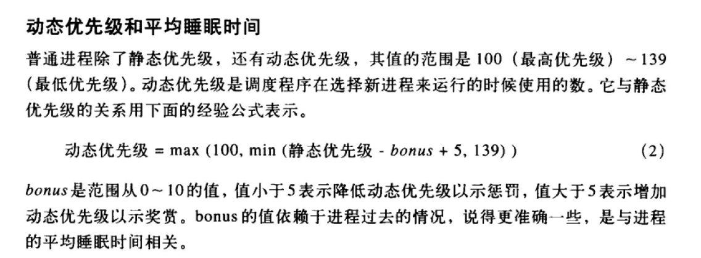
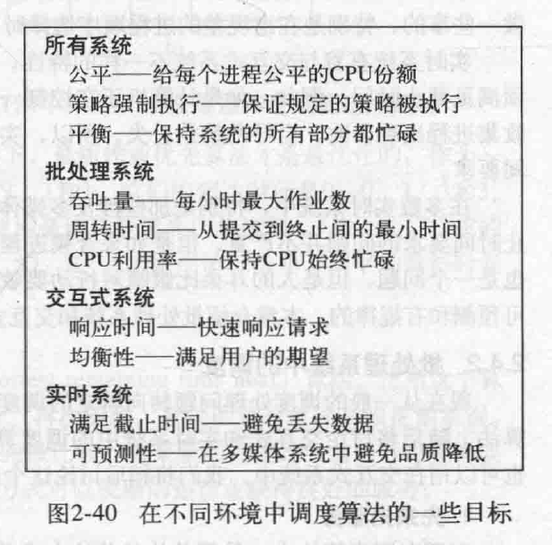
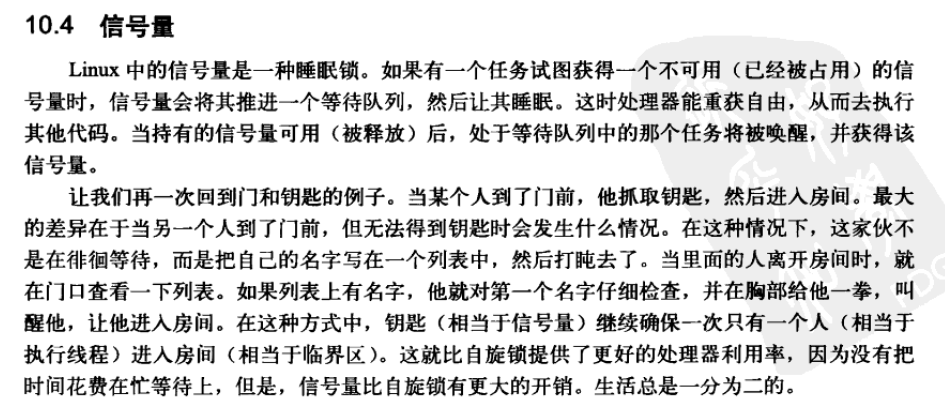
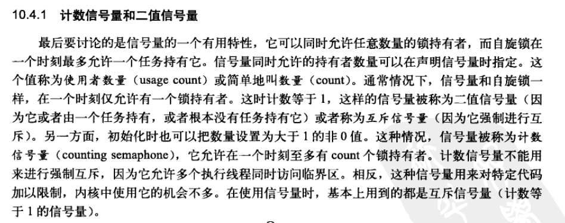
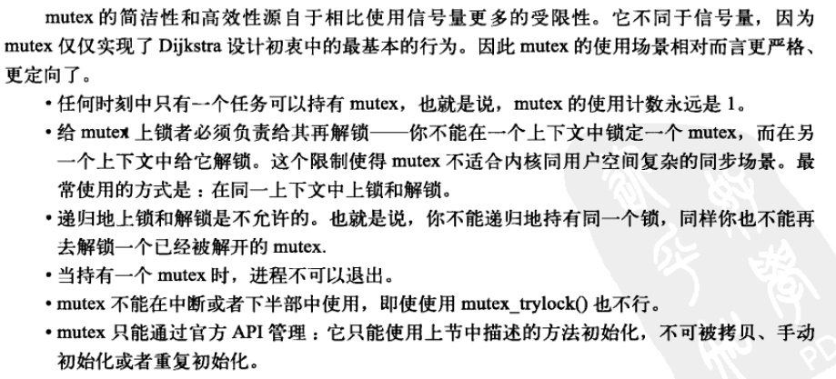
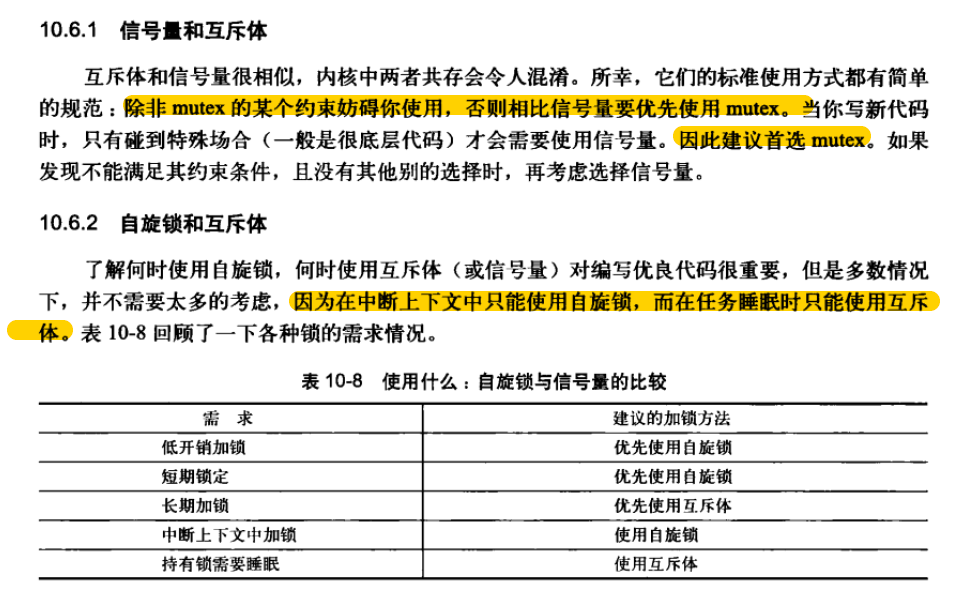

[TOC]
# 操作系统

## 进程和线程

###  进程和线程的区别

简而言之,一个程序至少有一个进程,一个进程至少有一个线程.
线程的划分尺度小于进程，使得多线程程序的并发性高。
另外，进程在执行过程中拥有独立的内存单元，而多个线程共享内存，从而极大地提高了程序的运行效率。
线程在执行过程中与进程还是有区别的。每个独立的线程有一个程序运行的入口、顺序执行序列和程序的出口。但是线程不能够独立执行，必须依存在应用程序中，由应用程序提供多个线程执行控制。
从逻辑角度来看，多线程的意义在于一个应用程序中，有多个执行部分可以同时执行。但操作系统并没有将多个线程看做多个独立的应用，来实现进程的调度和管理以及资源分配。这就是进程和线程的重要区别。

进程是具有一定独立功能的程序关于某个数据集合上的一次运行活动,进程是系统进行资源分配和调度的一个独立单位.
线程是进程的一个实体,是CPU调度和分派的基本单位,它是比进程更小的能独立运行的基本单位.线程自己基本上不拥有系统资源,只拥有一点在运行中必不可少的资源(如程序计数器,一组寄存器和栈),但是它可与同属一个进程的其他的线程共享进程所拥有的全部资源.
一个线程可以创建和撤销另一个线程;同一个进程中的多个线程之间可以并发执行.

**进程和线程的主要差别在于它们是不同的操作系统资源管理方式。进程有独立的地址空间，一个进程崩溃后，在保护模式下不会对其它进程产生影响，而线程只是一个进程中的不同执行路径。线程有自己的堆栈和局部变量，但线程之间没有单独的地址空间，一个线程死掉就等于整个进程死掉，所以多进程的程序要比多线程的程序健壮，但在进程切换时，耗费资源较大，效率要差一些。但对于一些要求同时进行并且又要共享某些变量的并发操作，只能用线程，不能用进程。如果有兴趣深入的话，我建议你们看看《现代操作系统》或者《操作系统的设计与实现》。对就个问题说得比较清楚。**


### Linux下的copy-on-write

在说明Linux下的copy-on-write机制前，我们首先要知道两个函数：fork()和exec()。需要注意的是exec()并不是一个特定的函数, 它是一组函数的统称, 它包括了execl()、execlp()、execv()、execle()、execve()、execvp()。

####1.1简单来用用fork

首先我们来看一下`fork()`函数是什么鬼：

> fork is an operation whereby a process creates a copy of itself.

fork是类Unix操作系统上**创建进程**的主要方法。fork用于**创建子进程**(等同于当前进程的副本)。

- 新的进程要通过老的进程复制自身得到，这就是fork！

如果接触过Linux，我们会知道Linux下**init进程是所有进程的爹**(相当于Java中的Object对象)

- Linux的进程都通过init进程或init的子进程fork(vfork)出来的。

 下面以例子说明一下fork吧：

```c++
#include <unistd.h>  
#include <stdio.h>  
 
int main ()   
{   
    pid_t fpid; //fpid表示fork函数返回的值  
    int count=0;
	
	// 调用fork，创建出子进程  
    fpid=fork();

	// 所以下面的代码有两个进程执行！
    if (fpid == -1)   
        printf("创建进程失败!/n");   
    else if (fpid == 0) {  
        printf("我是子进程，由父进程fork出来/n");   
        count++;  
    }  
    else if(fpid>0) {  
        printf("我是父进程/n");   
        count++;  
    }  
    printf("统计结果是: %d/n",count);  
    return 0;  
}  
```

得到的结果输出为：

```c++
我是子进程，由父进程fork出来

统计结果是: 1

我是父进程

统计结果是: 1

```

解释一下：

- fork作为一个函数被调用。这个函数会有**两次返回**，将**子进程的PID返回给父进程，0返回给子进程**。(如果小于0，则说明创建子进程失败)。
- 再次说明：当前进程调用`fork()`，会创建一个跟当前进程完全相同的子进程(除了pid)，所以子进程同样是会执行`fork()`之后的代码。

所以说：

- 父进程在执行if代码块的时候，`fpid变量`的值是子进程的pid
- 子进程在执行if代码块的时候，`fpid变量`的值是0

#### 1.2再来看看exec()函数

从上面我们已经知道了fork会创建一个子进程。**子进程的是父进程的副本**。

exec函数的作用就是：**装载一个新的程序**（可执行映像）覆盖**当前进程**内存空间中的映像，**从而执行不同的任务**。

- exec系列函数在执行时会**直接替换掉当前进程的地址空间**。

我去画张图来理解一下：


参考资料：

- 程序员必备知识——fork和exec函数详解[blog.csdn.net/bad_good_ma…](https://blog.csdn.net/bad_good_man/article/details/49364947)
- linux中fork（）函数详解（原创！！实例讲解）：[blog.csdn.net/jason314/ar…](https://blog.csdn.net/jason314/article/details/5640969)
- linux c语言 fork() 和 exec 函数的简介和用法：[blog.csdn.net/nvd11/artic…](https://blog.csdn.net/nvd11/article/details/8856278)
- Linux下Fork与Exec使用：[www.cnblogs.com/hicjiajia/a…](https://www.cnblogs.com/hicjiajia/archive/2011/01/20/1940154.html)
- Linux 系统调用 —— fork()内核源码剖析：[blog.csdn.net/chen8927040…](https://blog.csdn.net/chen892704067/article/details/76596225)

#### 1.3回头来看Linux下的COW是怎么一回事

> fork()会产生一个和父进程完全相同的子进程(除了pid)

如果按**传统**的做法，会**直接**将父进程的数据拷贝到子进程中，拷贝完之后，父进程和子进程之间的数据段和堆栈是**相互独立的**。


但是，以我们的使用经验来说：往往子进程都会执行`exec()`来做自己想要实现的功能。

- 所以，如果按照上面的做法的话，创建子进程时复制过去的数据是没用的(因为子进程执行`exec()`，原有的数据会被清空)

既然很多时候复制给子进程的数据是无效的，于是就有了Copy On Write这项技术了，原理也很简单：

- fork创建出的子进程，**与父进程共享内存空间**。也就是说，如果子进程**不对内存空间进行写入操作的话，内存空间中的数据并不会复制给子进程**，这样创建子进程的速度就很快了！(不用复制，直接引用父进程的物理空间)。
- 并且如果在fork函数返回之后，子进程**第一时间**exec一个新的可执行映像，那么也不会浪费时间和内存空间了。

另外的表达方式：

> 在fork之后exec之前两个进程**用的是相同的物理空间**（内存区），子进程的代码段、数据段、堆栈都是指向父进程的物理空间，也就是说，两者的虚拟空间不同，但其对应的**物理空间是同一个**。

> 当父子进程中**有更改相应段的行为发生时**，再**为子进程相应的段分配物理空间**。

> 如果不是因为exec，内核会给子进程的数据段、堆栈段分配相应的物理空间（至此两者有各自的进程空间，互不影响），而代码段继续共享父进程的物理空间（两者的代码完全相同）。

> 而如果是因为exec，由于两者执行的代码不同，子进程的代码段也会分配单独的物理空间。

Copy On Write技术**实现原理：**

> fork()之后，kernel把父进程中所有的内存页的权限都设为read-only，然后子进程的地址空间指向父进程。当父子进程都只读内存时，相安无事。当其中某个进程写内存时，CPU硬件检测到内存页是read-only的，于是触发页异常中断（page-fault），陷入kernel的一个中断例程。中断例程中，kernel就会**把触发的异常的页复制一份**，于是父子进程各自持有独立的一份。

Copy On Write技术**好处**是什么？

- COW技术可**减少**分配和复制大量资源时带来的**瞬间延时**。
- COW技术可减少**不必要的资源分配**。比如fork进程时，并不是所有的页面都需要复制，父进程的**代码段和只读数据段都不被允许修改，所以无需复制**。

Copy On Write技术**缺点**是什么？

- 如果在fork()之后，父子进程都还需要继续进行写操作，**那么会产生大量的分页错误(页异常中断page-fault)**，这样就得不偿失。

几句话总结Linux的Copy On Write技术：

- fork出的子进程共享父进程的物理空间，当父子进程**有内存写入操作时**，read-only内存页发生中断，**将触发的异常的内存页复制一份**(其余的页还是共享父进程的)。
- fork出的子进程功能实现和父进程是一样的。如果有需要，我们会用`exec()`把当前进程映像替换成新的进程文件，完成自己想要实现的功能。

参考资料：

- Linux进程基础：[www.cnblogs.com/vamei/archi…](http://www.cnblogs.com/vamei/archive/2012/09/20/2694466.html)
- Linux写时拷贝技术(copy-on-write)[www.cnblogs.com/biyeymyhjob…](http://www.cnblogs.com/biyeymyhjob/archive/2012/07/20/2601655.html)
- 当你在 Linux 上启动一个进程时会发生什么？[zhuanlan.zhihu.com/p/33159508](https://zhuanlan.zhihu.com/p/33159508)
- Linux fork()所谓的写时复制(COW)到最后还是要先复制再写吗？[www.zhihu.com/question/26…](https://www.zhihu.com/question/265400460)
- 写时拷贝（copy－on－write） COW技术[blog.csdn.net/u012333003/…](https://blog.csdn.net/u012333003/article/details/25117457)
- Copy-On-Write 写时复制原理[blog.csdn.net/ppppppppp20…](https://blog.csdn.net/ppppppppp2009/article/details/22750939)


#### [Linux写时拷贝技术(copy-on-write)](https://www.cnblogs.com/biyeymyhjob/archive/2012/07/20/2601655.html)

**COW技术初窥：**

​      在Linux程序中，fork（）会产生一个和父进程完全相同的子进程，但子进程在此后多会exec系统调用，出于效率考虑，linux中引入了“写时复制“技术，也就是只有进程空间的各段的内容要发生变化时，才会将父进程的内容复制一份给子进程。

​      那么子进程的物理空间没有代码，怎么去取指令执行exec系统调用呢？

​      在fork之后exec之前两个进程用的是相同的物理空间（内存区），子进程的代码段、数据段、堆栈都是指向父进程的物理空间，也就是说，两者的虚拟空间不同，但其对应的物理空间是同一个。当父子进程中有更改相应段的行为发生时，再为子进程相应的段分配物理空间，如果不是因为exec，内核会给子进程的数据段、堆栈段分配相应的物理空间（至此两者有各自的进程空间，互不影响），而代码段继续共享父进程的物理空间（两者的代码完全相同）。而如果是因为exec，由于两者执行的代码不同，子进程的代码段也会分配单独的物理空间。      

​      在网上看到还有个细节问题就是，fork之后内核会通过将子进程放在队列的前面，以让子进程先执行，以免父进程执行导致写时复制，而后子进程执行exec系统调用，因无意义的复制而造成效率的下降。

 

**COW详述：**

​     现在有一个父进程P1，这是一个主体，那么它是有灵魂也就身体的。现在在其虚拟地址空间（有相应的数据结构表示）上有：正文段，数据段，堆，栈这四个部分，相应的，内核要为这四个部分分配各自的物理块。即：正文段块，数据段块，堆块，栈块。至于如何分配，这是内核去做的事，在此不详述。

1.      现在P1用fork()函数为进程创建一个子进程P2，

内核：

（1）复制P1的正文段，数据段，堆，栈这四个部分，注意是其内容相同。

（2）为这四个部分分配物理块，P2的：正文段－＞PI的正文段的物理块，其实就是不为P2分配正文段块，让P2的正文段指向P1的正文段块，数据段－＞P2自己的数据段块（为其分配对应的块），堆－＞P2自己的堆块，栈－＞P2自己的栈块。如下图所示：同左到右大的方向箭头表示复制内容。

 


2.       写时复制技术：内核只为新生成的子进程创建虚拟空间结构，它们来复制于父进程的虚拟究竟结构，但是不为这些段分配物理内存，它们共享父进程的物理空间，当父子进程中有更改相应段的行为发生时，再为子进程相应的段分配物理空间。

 


 

3.       vfork()：这个做法更加火爆，内核连子进程的虚拟地址空间结构也不创建了，直接共享了父进程的虚拟空间，当然了，这种做法就顺水推舟的共享了父进程的物理空间

 


通过以上的分析，相信大家对进程有个深入的认识，它是怎么一层层体现出自己来的，进程是一个主体，那么它就有灵魂与身体，系统必须为实现它创建相应的实体， 灵魂实体与物理实体。这两者在系统中都有相应的数据结构表示，物理实体更是体现了它的物理意义。以下援引LKD

​     传统的fork()系统调用直接把所有的资源复制给新创建的进程。这种实现过于简单并且效率低下，因为它拷贝的数据也许并不共享，更糟的情况是，如果新进程打算立即执行一个新的映像，那么所有的拷贝都将前功尽弃。Linux的fork()使用写时拷贝（copy-on-write）页实现。写时拷贝是一种可以推迟甚至免除拷贝数据的技术。内核此时并不复制整个进程地址空间，而是让父进程和子进程共享同一个拷贝。只有在需要写入的时候，数据才会被复制，从而使各个进程拥有各自的拷贝。也就是说，资源的复制只有在需要写入的时候才进行，在此之前，只是以只读方式共享。这种技术使地址空间上的页的拷贝被推迟到实际发生写入的时候。在页根本不会被写入的情况下—举例来说，fork()后立即调用exec()—它们就无需复制了。fork()的实际开销就是复制父进程的页表以及给子进程创建惟一的进程描述符。在一般情况下，进程创建后都会马上运行一个可执行的文件，这种优化可以避免拷贝大量根本就不会被使用的数据（地址空间里常常包含数十兆的数据）。由于Unix强调进程快速执行的能力，所以这个优化是很重要的。这里补充一点：**Linux COW与exec没有必然联系**

### linux下的进程状态



进程状态： 新建、就绪、运行、阻塞、停止。


 #### 为什么要使用线程 ？

- 我觉得最根本的原因是：一些业务需求在同一个进程内进行并发操作，这种情况下用单个的进程是无法实现的。
- 这样就需要多个可以共享资源的进程，就产生了线程。在linux内，线程只是一种进程间共享资源的手段。
- 线程比进程更容易创建、也更容易撤销

#### 线程创建

unix系统线程创建和进程创建类似

#### 多进程与多线程

**2017.8.8更新**：之前的回答有问题有误，纠正一下，应该来说二者的切换开销没有太大差别。本质上进程/线程在Linux内核实现上都是Task（或者叫Thread，在内核里是同一个东东），只不过同源多线程对应的Task共享的东西多一些（最主要是地址空间）。所以即便是多线程切换，页表也还是要切换的，只不过页表内容相同而已；同样，对于多线程切换，TLB该刷还是要刷的，因为对于CPU来讲多线程与多进程一样，都有不同的标识和不同的上下文，为了保证一致性，TLB刷新就省不了。

  

**在Linux下编程多用多进程编程少用多线程编程**。

​         IBM有个家伙做了个测试，发现切换线程context的时候，windows比linux快一倍多。进出最快的锁（windows2k的 critical section和linux的pthread_mutex），windows比linux的要快五倍左右。当然这并不是说linux不好，而且在经过实际编程之后，综合来看我觉得linux更适合做high performance server，不过在多线程这个具体的领域内，linux还是稍逊windows一点。这应该是情有可原的，毕竟unix家族都是从多进程过来的，而 windows从头就是多线程的。

如果是UNIX/linux环境，采用多线程没必要。

多线程比多进程性能高？误导！

应该说，**多线程比多进程成本低，但性能更低**。

在UNIX环境，多进程调度开销比多线程调度开销，没有显著区别，就是说，UNIX进程调度效率是很高的。内存消耗方面，二者只差全局数据区，现在内存都很便宜，服务器内存动辄若干G，根本不是问题。

**多进程是立体交通系统，虽然造价高，上坡下坡多耗点油，但是不堵车。**

**多线程是平面交通系统，造价低，但红绿灯太多，老堵车。**

我们现在都开跑车，油（主频）有的是，不怕上坡下坡，就怕堵车。


**多线程的优点：**

无需跨进程边界； 程序逻辑和控制方式简单； 所有线程可以直接共享内存和变量等； 线程方式消耗的总资源比进程方式好；

 **多线程缺点：**

每个线程与主程序共用地址空间，受限于2GB地址空间； 线程之间的同步和加锁控制比较麻烦； 一个线程的崩溃可能影响到整个程序的稳定性； 到达一定的线程数程度后，即使再增加CPU也无法提高性能，例如Windows Server 2003，大约是1500个左右的线程数就快到极限了（线程堆栈设定为1M），如果设定线程堆栈为2M，还达不到1500个线程总数； 线程能够提高的总性能有限，而且线程多了之后，线程本身的调度也是一个麻烦事儿，需要消耗较多的CPU

**多进程优点：**

每个进程互相独立，不影响主程序的稳定性，子进程崩溃没关系； 通过增加CPU，就可以容易扩充性能； 可以尽量减少线程加锁/解锁的影响，极大提高性能，就算是线程运行的模块算法效率低也没关系； 每个子进程都有2GB地址空间和相关资源，总体能够达到的性能上限非常大 

**多线程缺点：**

逻辑控制复杂，需要和主程序交互； 需要跨进程边界，如果有大数据量传送，就不太好，适合小数据量传送、密集运算 多进程调度开销比较大； 最好是多进程和多线程结合，即根据实际的需要，每个CPU开启一个子进程，这个子进程开启多线程可以为若干同类型的数据进行处理。当然你也可以利用多线程+多CPU+轮询方式来解决问题……

方法和手段是多样的，关键是自己看起来实现方便有能够满足要求，代价也合适。

－－－－－－－－－－－－－－－－－－－－－－－－－－－－－－－－－－－－－－－－－－－－－－－－－－－－－－－－－

**进程的优点：**

1）顺序程序的特点：具有封闭性和可再现性；

2）程序的并发执行和资源共享。多道程序设计出现后，实现了程序的并发执行和资源共享，提高了系统的效率和系统的资源利用率。 

**进程的缺点：**

操作系统调度切换多个线程要比切换调度进程在速度上快的多。而且进程间内存无法共享，通讯也比较麻烦。

线程之间由于共享进程内存空间，所以交换数据非常方便；在创建或撤消进程时，由于系统都要为之分配和回收资源，导致系统的开销明显大于创建或撤消线程时的开销。    

**线程的优点：**

1）它是一种非常"节俭"的多任务操作方式。在Linux系统下，启动一个新的进程必须分配给它独立的地址空间，建立众多的数据表来维护它的代码段、堆栈段和数据段，这是一种"昂贵"的多任务工作方式。而运行于一个进程中的多个线程，它们彼此之间使用相同的地址空间，共享大部分数据，启动一个线程所花费的空间远远小于启动一个进程所花费的空间，而且，线程间彼此切换所需的时间也远远小于进程间切换所需要的时间。当然，在具体的系统上，这个数据可能会有较大的区别；

2）线程间方便的通信机制，由于同一进程下的线程之间共享数据空间，所以一个线程的数据可以直接为其它线程所用，这不仅快捷，而且方便；

3）使多CPU系统更加有效。操作系统会保证当线程数不大于CPU数目时，不同的线程运行于不同的CPU上；

4）改善程序结构。一个既长又复杂的进程可以考虑分为多个线程，成为几个独立或半独立的运行部分，这样的程序会利于理解和修改。

 **线程的缺点：** 1.调度时, 要保存线程状态，频繁调度, 需要占用大量的机时； 2.程序设计上容易出错（线程同步问题）。


 #### 线程的实现方式



 

 

 前言

- linux内核不存在整真正意义上的线程。linux将所有的执行实体都称之为任务（task），每一个任务在干年上都类似于一个单线程的进程，具有内存空间、执行实体、文件资源等。但是，linux下不同任务之间可以选择公用内存空间，因而在实际意义上，共享同一个内存空间的多个任务构成了一个进程，而这些任务就成为这个任务里面的线程。

#### 内核线程（在内核中实现线程）

- 内核线程又称为守护进程，内核线程的调度由内核负责，一个内核线程处于阻塞状态时不影响其他的内核线程，因为其是调度的基本单位。这与用户线程是不一样的；
- 这些线程可以在全系统内进行资源的竞争；
- 内核空间内为每一个内核支持线程设置了一个线程控制块（TCB），内核根据该控制块，感知线程的存在，并进行控制。在一定程度上类似于进程，只是创建、调度的开销要比进程小。有的统计是1：10。
- 内核线程切换由内核控制，当线程进行切换的时候，由用户态转化为内核态。切换完毕要从内核态返回用户态，**即存在用户态和内核态之间的转换**，**比如多核cpu，还有win线程的实现**。

##### 优点

在多处理器系统中，内核能够同时调度同一进程中多个线程并行执行到多个处理器中；如果进程中的一个线程被阻塞，内核可以调度同一个进程中的另一个线程；内核支持线程具有很小的数据结构和堆栈，线程的切换比较快，切换开销小；内核本身也可以使用多线程的方式来实现。

##### 缺点

即使CPU在同一个进程的多个线程之间切换，也需要陷入内核，因此其速度和效率不如用户级线程。

**内核级线程速度慢**

#### 用户线程（在用户空间中实现线程）

- 用户线程在用户空间中实现，内核并没有直接对用户线程进程调度，内核的调度对象和传统进程一样，还是进程（用户进程）本身，内核并不能看到用户线程，内核并不知道用户线程的存在。
- 不需要内核支持而在用户程序中实现的线程，其不依赖于操作系统核心，应用进程利用线程库提供创建、同步、调度和管理线程的函数来控制用户线程。
- 内核资源的分配仍然是按照进程（用户进程）进行分配的；**各个用户线程只能在进程内进行资源竞争**。
- 用户级线程内核的切换由用户态程序自己控制内核切换（通过系统调用来获得内核提供的服务）,不需要内核干涉，少了进出内核态的消耗，但不能很好的利用多核Cpu。**目前Linux pthread大体是这么做的**。
- 每个用户线程并不具有自身的线程上下文。因此，就线程的同时执行而言，任意给定时刻每个进程只能够有一个线程在运行，而且只有一个处理器内核会被分配给该进程。

##### 优点

线程的切换无需陷入内核，故切换开销小，速度非常快；

#####缺点

系统调用的阻塞问题：对应用程序来讲，**同一进程中只能同时有一个线程在运行**，一个线程的阻塞将导致整个进程中所有线程的阻塞；由于这里的处理器时间片分配是以进程为基本单位，所以每个线程执行的时间相对减少。

####用户级线程和内核级线程的区别

-  **内核支持：**用户级线程可在一个不支持线程的OS中实现；内核支持线程则需要得到OS内核的支持。亦即内核支持线程是OS内核可感知的，而用户级线程是OS内核不可感知的。
-  **处理器分配：**在多处理机环境下，对用户级线程而言主，内核一次只为一个进程分配一个处理器，进程无法享用多处理机带来的好处；在设置有内核支持线程时，内核可调度一个应用中的多个线程同时在多个处理器上并行运行，提高程序的执行速度和效率。
-  **调度和线程执行时间：**设置有内核支持线程的系统，其调度方式和算法与进程的调度十分相似，只不过调度单位是线程；对只设置了用户级线程的系统，调度的单位仍为进程。
-  用户级线程执行系统调用指令时将导致其所属进程被中断，而内核支持线程执行系统调用指令时，只导致该线程被中断。
-  在只有用户级线程的系统内，CPU调度还是以进程为单位，处于运行状态的进程中的多个线程，由用户程序控制线程的轮换运行；在有内核支持线程的系统内，CPU调度则以线程为单位，由OS的线程调度程序负责线程的调度。

### linux下的睡眠和唤醒

在[Linux](https://link.zhihu.com/?target=http%3A//www.magedu.com/) 中，仅等待 CPU 时间的进程称为就绪进程，它们被放置在一个运行队列中，一个就绪进程的状 态标志位为 TASK_RUNNING。一旦一个运行中的进程时间片用完， Linux 内核的调度器会剥夺这个进程对 CPU 的控制权，并且从运行队列中选择一个合适的进程投入运行。

当然，一个进程也可以主动释放 CPU 的控制权。函数 schedule() 是一个调度函数，它可以被一个进程主动调用，从而调度其它进程占用 CPU。一旦这个主动放弃 CPU 的进程被重新调度占用 CPU，那么它将从上次停止执行的位置开始执行，也就是说它将从调用 schedule() 的下一行代码处开始执行。

有时候，进程需要等待直到某个特定的事件发生，例如设备初始化完成、I/O 操作完成或定时器到时等。在这种情况下，进程则必须从运行队列移出，加入到一个等待队列中，这个时候进程就进入了睡眠状态。

Linux 中的进程睡眠状态有两种：一种是可中断的睡眠状态，其状态标志位

TASK_INTERRUPTIBLE；

另一种是不可中断 的睡眠状态，其状态标志位为 TASK_UNINTERRUPTIBLE。可中断的睡眠状态的进程会睡眠直到某个条件变为真，比如说产生一个硬件中断、释放 进程正在等待的系统资源或是传递一个信号都可以是唤醒进程的条件。不可中断睡眠状态与可中断睡眠状态类似，但是它有一个例外，那就是把信号传递到这种睡眠 状态的进程不能改变它的状态，也就是说它不响应信号的唤醒。不可中断睡眠状态一般较少用到，但在一些特定情况下这种状态还是很有用的，比如说：进程必须等 待，不能被中断，直到某个特定的事件发生。

在现代的 Linux 操作系统中，进程一般都是用调用 schedule() 的方法进入睡眠状态的，下面的代码演示了如何让正在运行的进程进入睡眠状态。

```C++
sleeping_task = current;
set_current_state(TASK_INTERRUPTIBLE);
schedule();
func1();
/* Rest of the code ... */

```

在第一个语句中，程序存储了一份进程结构指针 sleeping_task，current 是一个宏，它指向正在执行的进程结构。set_current_state() 将该进程的状态从执行状态 TASK_RUNNING 变成睡眠状态TASK_INTERRUPTIBLE。 如果 schedule() 是被一个状态为TASK_RUNNING 的进程调度，那么 schedule() 将调度另外一个进程占用 CPU；如果 schedule() 是被一个状态为 TASK_INTERRUPTIBLE 或 TASK_UNINTERRUPTIBLE 的进程调度，那么还有一个附加的步骤将被执行：当前执行的进程在另外一个进程被调度之前会被从运行队列中移出，这将导致正在运行的那个进程进入睡眠，因为 它已经不在运行队列中了。

我们可以使用下面的这个函数将刚才那个进入睡眠的进程唤醒。

wake_up_process(sleeping_task);

在调用了 wake_up_process() 以后，这个睡眠进程的状态会被设置为 TASK_RUNNING，而且调度器会把它加入到运行队列中去。当然，这个进程只有在下次被调度器调度到的时候才能真正地投入运行。

2 无效唤醒

几乎在所有的情况下，进程都会在检查了某些条件之后，发现条件不满足才进入睡眠。可是有的时候进程却会在 判定条件为真后开始睡眠，如果这样的话进程就会无限期地休眠下去，这就是所谓的无效唤醒问题。在操作系统中，当多个进程都企图对共享数据进行某种处理，而 最后的结果又取决于进程运行的顺序时，就会发生竞争条件，这是操作系统中一个典型的问题，无效唤醒恰恰就是由于竞争条件导致的。

设想有两个进程 A 和 B，A 进程正在处理一个链表，它需要检查这个链表是否为空，如果不空就对链表里面的数据进行一些操作，同时 B 进程也在往这个链表添加节点。当这个链表是空的时候，由于无数据可操作，这时 A 进程就进入睡眠，当 B 进程向链表里面添加了节点之后它就唤醒 A 进程，其代码如下：

**A 进程:**

```c++
spin_lock(&list_lock);
if(list_empty(&list_head)) {
	spin_unlock(&list_lock);
	set_current_state(TASK_INTERRUPTIBLE);
	schedule();
	spin_lock(&list_lock);
}
/* Rest of the code ... */
spin_unlock(&list_lock);

```

**B 进程:**

```c++
spin_lock(&list_lock);
list_add_tail(&list_head, new_node);
spin_unlock(&list_lock);
wake_up_process(processa_task);
```

这里会出现一个问题，假如当 A 进程执行到第 3 行后第 4 行前的时候，B 进程被另外一个处理器调度投入运行。在这个时间片内，B 进程执行完了它所有的指令，因此它试图唤醒 A 进程，而此时的 A 进程还没有进入睡眠，所以唤醒操作无效。在这之后，A 进程继续执行，它会错误地认为这个时候链表仍然是空的，于是将自己的状态设置为 TASK_INTERRUPTIBLE 然后调用 schedule() 进入睡 眠。由于错过了 B 进程唤醒，它将会无限期的睡眠下去，这就是无效唤醒问题，因为即使链表中有数据需要处理，A 进程也还是睡眠了。

3 避免无效唤醒

如何避免无效唤醒问题呢？我们发现无效唤醒主要发生在检查条件之后和进程状态被设置为睡眠状态之前， 本来 B 进程的 wake_up_process() 提供了一次将 A 进程状态置为 TASK_RUNNING 的机会，可惜这个时候 A 进程的状态仍然是 TASK_RUNNING，所以 wake_up_process() 将 A 进程状态从睡眠状态转变为运行状态的努力 没有起到预期的作用。要解决这个问题，必须使用一种保障机制使得判断链表为空和设置进程状态为睡眠状态成为一个不可分割的步骤才行，也就是必须消除竞争条 件产生的根源，这样在这之后出现的 wake_up_process () 就可以起到唤醒状态是睡眠状态的进程的作用了。
找到了原因后，重新设计一下 A 进程的代码结构，就可以避免上面例子中的无效唤醒问题了。

**A 进程:**

```C++
set_current_state(TASK_INTERRUPTIBLE);
spin_lock(&list_lock);
if(list_empty(&list_head)) {
	spin_unlock(&list_lock);
	schedule();
	spin_lock(&list_lock);
}
set_current_state(TASK_RUNNING);
/* Rest of the code ... */
spin_unlock(&list_lock);

```

可以看到，这段代码在测试条件之前就将当前执行进程状态转设置成 TASK_INTERRUPTIBLE 了，并且在链表不为空的情况下又将自己置为 TASK_RUNNING 状态。这样一来如果 B 进程在 A 进程进程检查了链表为空以后调用 wake_up_process()，那么 A 进程的状态就会自动由原来 TASK_INTERRUPTIBLE变成 TASK_RUNNING，此后即使进程又调用了 schedule()，由于它现在的状态是 TASK_RUNNING，所以仍然不会被从运行队列中移出，因而不会错误的进入睡眠，当然也就避免了无效唤醒问题。

小结

通过上面的讨论，可以发现在 Linux 中避免进程的无效唤醒的关键是在进程检查条件之前就将进程的状态置为 TASK_INTERRUPTIBLE 或 TASK_UNINTERRUPTIBLE，并且如果检查的条件满足的话就应该将其状态重新设置为 TASK_RUNNING。这样无论进程等待的条件是否满足， 进程都不会因为被移出就绪队列而错误地进入睡眠状态，从而避免了无效唤醒问题。

 ## 操作系统的调度算法 

### 为什么调度？

单核cpu，同一时间只能跑一个进程，如果就绪进程队列中有多个进程，下一时刻那个进程先运行呢？就需要调度。操作系统中完成这一任务的被称为调度程序，改程序使用的算法被称为调度算法。

### linux下的进程调度

#### 进程优先级

　　进程提供了两种优先级，一种是普通的进程优先级，第二个是实时优先级。前者适用SCHED_NORMAL调度策略，后者可选SCHED_FIFO或SCHED_RR调度策略。**任何时候，实时进程的优先级都高于普通进程**，实时进程只会被更高级的实时进程抢占，同级实时进程之间是按照FIFO（一次机会做完）或者RR（多次轮转）规则调度的。


####实时进程的调度

　　实时进程，只有静态优先级，因为内核不会再根据休眠等因素对其静态优先级做调整，其范围在0~MAX_RT_PRIO-1间。默认MAX_RT_PRIO配置为100，也即，默认的实时优先级范围是0~99。而nice值，影响的是优先级在MAX_RT_PRIO~MAX_RT_PRIO+40范围内的进程。

　　不同与普通进程，系统调度时，实时优先级高的进程总是先于优先级低的进程执行。知道实时优先级高的实时进程无法执行。实时进程总是被认为处于活动状态。如果有数个 优先级相同的实时进程，那么系统就会按照进程出现在队列上的顺序选择进程。假设当前CPU运行的实时进程A的优先级为a，而此时有个优先级为b的实时进程B进入可运行状态，那么只要b<a，系统将中断A的执行，而优先执行B，直到B无法执行（无论A，B为何种实时进程）。

 　　不同调度策略的实时进程只有在相同优先级时才有可比性：

 　　1. 对于FIFO的进程，意味着只有当前进程执行完毕才会轮到其他进程执行。由此可见相当霸道。

 　　2. 对于RR的进程。一旦时间片消耗完毕，则会将该进程置于队列的末尾，然后运行其他相同优先级的进程，如果没有其他相同优先级的进程，则该进程会继续执行。

 　　总而言之，对于实时进程，高优先级的进程就是大爷。它执行到没法执行了，才轮到低优先级的进程执行。等级制度相当森严啊。




#### 普通进程的调度

　Linux对普通的进程，根据动态优先级进行调度。而动态优先级是由静态优先级（static_prio）调整而来。Linux下，静态优先级是用户不可见的，隐藏在内核中。而内核提供给用户一个可以影响静态优先级的接口，那就是nice值，两者关系如下：

　　static_prio=MAX_RT_PRIO +nice+ 20

　　nice值的范围是-20~19，因而静态优先级范围在100~139之间。nice数值越大就使得static_prio越大，最终进程优先级就越低。

　　ps -el 命令执行结果：NI列显示的每个进程的nice值，PRI是进程的优先级（如果是实时进程就是静态优先级，如果是非实时进程，就是动态优先级）　　

　　而进程的时间片就是完全依赖 static_prio 定制的，见下图，摘自《深入理解linux内核》，

　　

 　　

我们前面也说了，系统调度时，还会考虑其他因素，因而会计算出一个叫进程动态优先级的东西，根据此来实施调度。因为，不仅要考虑静态优先级，也要考虑进程的属性。例如如果进程属于交互式进程，那么可以适当的调高它的优先级，使得界面反应地更加迅速，从而使用户得到更好的体验。Linux2.6 在这方面有了较大的提高。Linux2.6认为，交互式进程可以从平均睡眠时间这样一个measurement进行判断。进程过去的睡眠时间越多，则越有可能属于交互式进程。则系统调度时，会给该进程更多的奖励（bonus），以便该进程有更多的机会能够执行。奖励（bonus）从0到10不等。

　　系统会严格按照动态优先级高低的顺序安排进程执行。动态优先级高的进程进入非运行状态，或者时间片消耗完毕才会轮到动态优先级较低的进程执行。动态优先级的计算主要考虑两个因素：静态优先级，进程的平均睡眠时间也即bonus。计算公式如下，

​     dynamic_prio = max (100, min (static_prio - bonus + 5, 139))

　　在调度时，Linux2.6 使用了一个小小的trick，就是算法中经典的空间换时间的思想[**还没对照源码确认**]，使得计算最优进程能够在O(1)的时间内完成。

 　**为什么根据睡眠和运行时间确定奖惩分数是合理的**

　　睡眠和CPU耗时反应了进程IO密集和CPU密集两大瞬时特点，不同时期，一个进程可能即是CPU密集型也是IO密集型进程。对于表现为IO密集的进程，应该经常运行，但每次时间片不要太长。对于表现为CPU密集的进程，CPU不应该让其经常运行，但每次运行时间片要长。交互进程为例，假如之前其其大部分时间在于等待CPU，这时为了调高相应速度，就需要增加奖励分。另一方面，如果此进程总是耗尽每次分配给它的时间片，为了对其他进程公平，就要增加这个进程的惩罚分数。**可以参考CFS的virtutime机制.**

**现代方法CFS**

　　不再单纯依靠进程优先级绝对值，而是参考其绝对值，综合考虑所有进程的时间，给出当前调度时间单位内其应有的权重，也就是，每个进程的权重X单位时间=应获cpu时间，但是这个应得的cpu时间不应太小（假设阈值为1ms），否则会因为切换得不偿失。但是，当进程足够多时候，肯定有很多不同权重的进程获得相同的时间——最低阈值1ms，所以，CFS只是近似完全公平。

### 一般的进程调度算法





#### 批处理系统

- 先来先服务
  - 一个链表表示一个队列，新作业或者由阻塞状态变为运行状态的进程加到队列末尾即可。
  - 优点：有利于长作业以及CPU繁忙的作业 
  - 缺点：不利于短作业以及I/O繁忙的作业 

最短作业优先

- 对预计执行时间短的作业（进程）优先分派处理机.通常后来的短作业不抢先正在执行的作业. 

- 优点：

  比FCFS改善平均周转时间和平均带权周转时间，缩短作业的等待时间；

  提高系统的吞吐量；

- 缺点：

  对长作业非常不利，可能长时间得不到执行；

  未能依据作业的紧迫程度来划分执行的优先级；

  难以准确估计作业（进程）的执行时间，从而影响调度性能。


#### 交互式系统

round robin

- 一个链表表示一个队列，新作业、由阻塞状态变为运行状态、时间片用完的进程加到队列末尾即可。
- 优点：经典的做法
- 缺点：时间片设置过短会导致过多的进程切换，降低了cpu效率；时间片设置过长又可能引起对短的交互请求响应时间变长。 

优先级调度

- 非抢占式优先权算法 （批处理）
- 抢占式优先权调度算法 （交互式）参考上述linux系统的调用算法
- 

## 进程间通信的方式和区别 


## linux内核同步技术

### 为什么要同步


还是竞争条件和临界区问题，几个线程同时访问同一个临界区


### 同步方法

#### 原子操作

- 原子整数操作：atomic_t类型 和 一些对应的原子操作函数
- 

- 像int data++这种操作，无需加锁，直接使用原子操作，加锁开销太大了。

#### 自旋锁


#### 读写自旋锁

- 读写自旋锁是为了增加内核的并发能力。
- 我们知道在共享资源的并发程序中，对共享数据的写操作是互斥的，但是只要没有写操作，对共享数据的并发读操作是安全的。
- 一个或多个读任务可以并发的持有读者锁，用于写的锁最多只能被一个写任务持有。
- 有时把读写锁也叫共享锁和排他锁。
- 下面这一点很重要。读会延迟写，对读友好，适用读侧重场合


#### 顺序锁

- linux 2.6中引入顺序锁，与自旋锁类似，不过写者赋予了较高的优先级，在《深入理解linux内核》中说到，即使读者在读的时候也允许写者继续运行。
- 顺序锁，支持读并发，写写/读写间互斥，写会延迟读，对写友好，适用写侧重场合；
- 优点：写者永远不会等待（除非另一个写着在写）
- 缺点：有些时候读者不得不反复多次读相同的数据，直到它获得有效的副本。

#### 信号量

所谓“**进程上下文**”，就是一个进程在执行的时候，CPU的所有寄存器中的值、进程的状态以及堆栈上的内容，当内核需要切换到另一个进程时，它需要保存当前进程的所有状态，即保存当前进程的进程上下文，以便再次执行该进程时，能够恢复切换时的状态，继续执行。

所谓“**中断上下文**”，就是硬件通过触发信号，导致内核调用中断处理程序，进入内核空间。这个过程中，硬件的一些变量和参数也要传递给内核，内核通过这些参数进行中断处理。中断上下文，其实也可以看作就是硬件传递过来的这些参数和内核需要保存的一些其他环境（主要是当前被中断的进程环境）。




**信号量的特点：**




#### 读写信号量


**看到这里我想起了陈硕在他的书中说，尽量不要用读写锁和信号量**，那用什么呢，

#### 互斥体







#### 禁止抢占

内核是抢占性的；可能随时被停下来。因此一个任务与被抢占的任务可能会在同一个临界区内运行(新调度的任务可能访问被切换的同一个变量)。内核抢占代码使用自旋锁作为非抢占区域的标记。一个自旋锁被持有，内核便不能进行抢占。

可以通过`preempt_disable()`禁止内核抢占。直到`preempt_enable()`被启用之后才能重新启用。


### 锁的缺点

- 但锁的并行可扩展性很差，无法充分发挥多核的性能优势。
- 锁的粒度太粗会限制扩展性，粒度太细会导致巨大的系统开销，而且设计难度大，容易造成死锁。
- 除了并发可扩展性差和死锁外，锁还会引入很多其他问题，如[锁惊群](https://blog.csdn.net/aazhzhu/article/details/89967346)、活锁、饥饿、不公平锁、优先级反转等。不过也有一些技术手段或指导原则能解决或减轻这些问题的风险。

- 按统一的顺序使用锁（锁的层次），解决死锁问题；
- 指数后退，解决活锁/饥饿问题；
- 范围锁（树状锁），解决锁惊群问题；
- 优先级继承，解决优先级反转问题；

## 虚拟内存机制的作用 


## 缓存的作用以及缓存替换算法 

## 虚拟文件系统 


 

 

 

 


 

 

 

 